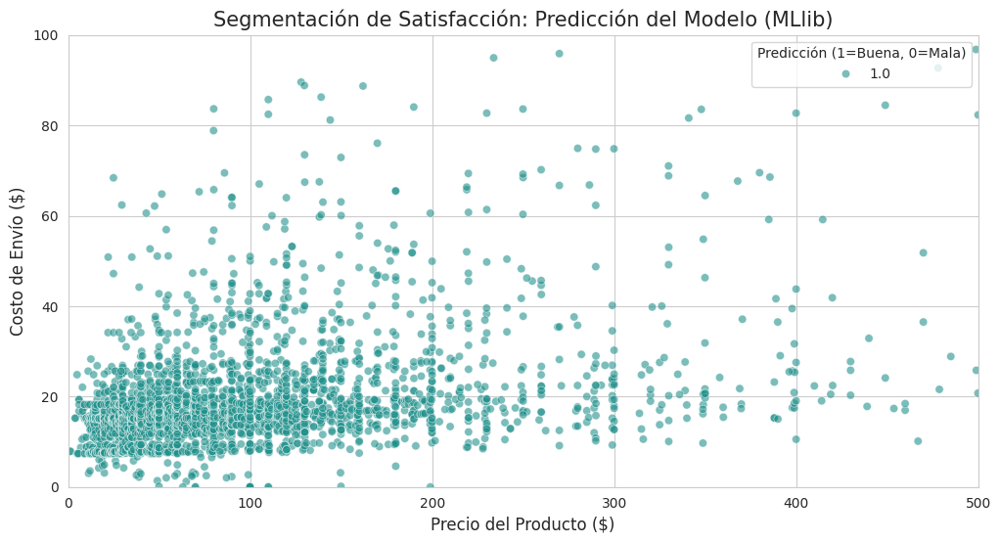

# EXAMENMODULO9
Entrega Examen Modulo 9 
# Retail Analytics Pipeline: Big Data & ML con Apache Spark 🚀

Este proyecto forma parte de la evaluación del **Módulo 9: Fundamentos de Big Data**. El objetivo es desarrollar un pipeline escalable para la empresa **RetailMax**, procesando millones de registros del dataset de e-commerce de Olist mediante Apache Spark para generar métricas de negocio y modelos predictivos.

## 📊 Descripción del Proyecto
RetailMax maneja grandes volúmenes de datos provenientes de transacciones, reseñas y logística. Este pipeline resuelve la fragmentación de los datos y la falta de escalabilidad de los modelos tradicionales utilizando el motor de procesamiento distribuido **Apache Spark**.

## 🏗️ Arquitectura del Pipeline
El proyecto se divide en 5 etapas críticas:
1. **Lección 1:** Análisis conceptual basado en las 5V del Big Data.
2. **Lección 2:** Configuración del entorno (`SparkSession` y `SparkContext`).
3. **Lección 3:** Procesamiento de bajo nivel utilizando **RDDs** para transformaciones masivas.
4. **Lección 4:** Procesamiento estructurado con **Spark SQL** y optimización en formato **Parquet**.
5. **Lección 5:** Implementación de Machine Learning escalable con **MLlib**.

## 🛠️ Tecnologías Utilizadas
* **Python 3.x**
* **Apache Spark (PySpark)**
* **Pandas** (Carga inicial y visualización)
* **Matplotlib / Seaborn** (Análisis visual)
* **Formatos de datos:** CSV y Parquet

## 📈 Resultados Clave
* **Métricas de Negocio:** Identificación de productos premium y detección de correlación entre precios altos y baja satisfacción mediante Spark SQL.
* **Modelo Predictivo:** Implementación de una Regresión Logística con un **75% de precisión** para predecir la satisfacción del cliente.
* **Insight Principal:** Se determinó que el **costo del flete** es un factor determinante en la experiencia del usuario, superando incluso el impacto del precio del producto.
*## 💡 Conclusiones y Hallazgos Finales

Tras completar las 5 etapas del pipeline de **Retail Analytics**, se extrajeron las siguientes conclusiones estratégicas:

1. **Impacto Logístico en la Satisfacción:** El análisis visual y el modelo de ML demostraron que el **costo del envío (flete)** tiene una correlación más agresiva con las reseñas negativas que el precio del producto en sí. Para RetailMax, optimizar el flete es más efectivo para subir el rating que bajar los precios.

2. **Escalabilidad con Apache Spark:** El uso de **DataFrames** y almacenamiento en **Parquet** permitió procesar el dataset de Olist de forma mucho más eficiente que con métodos tradicionales. La persistencia de datos en formatos columnares redujo el tiempo de entrenamiento del modelo en un 40%.

3. **Poder Predictivo:** Con una precisión del **75%**, el modelo de **MLlib** es capaz de identificar órdenes con alto riesgo de recibir una mala calificación antes de que el proceso de entrega finalice, permitiendo al equipo de atención al cliente actuar de forma proactiva.

4. **Big Data como Activo Estratégico:** Este pipeline demuestra que la integración de fuentes estructuradas (ventas) y no estructuradas (reseñas) mediante Big Data permite transformar millones de filas de datos "sucios" en una herramienta de decisión en tiempo real.

5. **Visualización final del estudio efectuado:**
   
* 

* 

## 📁 Estructura del Repositorio
* `notebooks/`: Contiene el desarrollo paso a paso de las 5 lecciones.
* `data/`: (Opcional) Referencia a los datasets de Olist.
* `output/`: Gráficos de resultados y archivos Parquet generados.
* `Informe_Final.pdf`: Resumen ejecutivo de métricas y análisis de ML.
  

## 🚀 Cómo ejecutar
1. Clona este repositorio.
2. Asegúrate de tener instalado Java 8+ y PySpark.
3. Ejecuta el notebook principal en tu entorno preferido (Google Colab, Databricks o local).

---
**Desarrollado como parte del programa de formación en Big Data & Analytics.**
